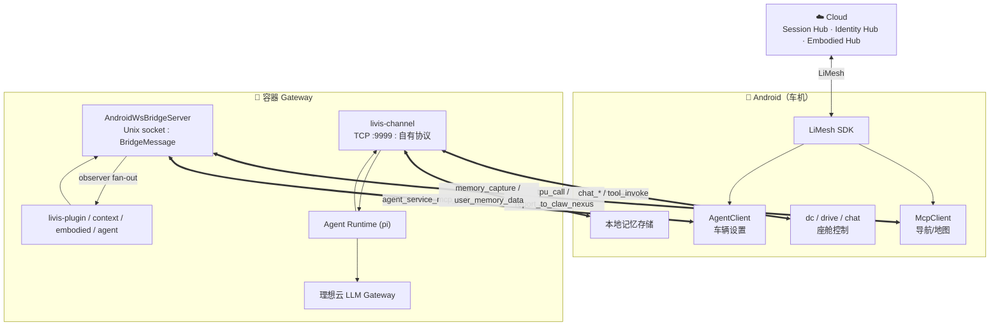

# LiClaw 端云协同架构分析

> 基于 OpenClaw（`github.com/openclaw/openclaw`）fork，针对理想汽车车载/具身场景的增强分支。
> 分析日期：2026-01-17。所有结论均标注源码出处。

---

## 目录

1. [整体分层](#1-整体分层)
2. [端云协同总览](#2-端云协同总览)
3. [双通道架构](#3-双通道架构)
4. [android-socket-bridge 详解](#4-android-socket-bridge-详解)
5. [livis-channel 详解](#5-livis-channel-详解)
6. [消息协议全集](#6-消息协议全集)
7. [流量治理与排队阻塞](#7-流量治理与排队阻塞)
8. [Tool 调用路径全景](#8-tool-调用路径全景)
9. [记忆架构](#9-记忆架构)
10. [身份与会话同步](#10-身份与会话同步)
11. [辅助插件](#11-辅助插件)

---

## 1. 整体分层

**来源：** `AGENTS.md` Map 节 + `docs/tools/index.md` + `docs/concepts/`

设计原则（原文）：*"Core stays plugin-agnostic"*——能力通过插件注入，非硬编码到核心。

### 1.1 四层核心概念

| 层 | 是什么 | 怎么工作 |
|---|---|---|
| **Agent Runtime** | 拥有一次完整 model-loop 的组件 | PI 嵌入式 / Codex app-server / claude-cli 等，每轮对话跑 `intake → context → model → tools → reply → persist` |
| **Tool** | 模型可调用的类型化函数 | 以 structured function definition 发给模型；可见性经 allow/deny + provider + sandbox + channel 多层裁剪 |
| **Skill** | 注入 prompt 的指令包 | `SKILL.md`（AgentSkills 兼容），教 agent 怎么用 tool。按优先级覆盖，加载时 gating 过滤 |
| **Memory** | 持久化事实/偏好/上下文 | 纯 Markdown 文件（`MEMORY.md` + `memory/*.md`），后端可插拔（SQLite / QMD / Honcho / LanceDB） |

四者协作链：

```
[Channel 入站消息]
    ↓
[Agent Runtime] ← 注入 [Skills] + [Memory 检索结果]
    ├─ 暴露 [Tools] function definitions
    ├─ 执行 tool → hook 拦截 → 回写 transcript
    └─ 完成后: memory flush → dreaming → commitments
```

### 1.2 Agent Runtime

**来源：** `docs/concepts/agent-runtimes.md` + `agent-loop.md`

| 层 | 例 | 含义 |
|---|---|---|
| Provider | `openai`, `anthropic` | 鉴权、发现模型、命名 model ref |
| Model | `gpt-5.5`, `claude-opus-4-6` | 选定的模型 |
| **Agent Runtime** | `pi`, `codex`, `claude-cli` | 执行 prepared turn 的底层循环 |
| Channel | Telegram, Discord... | 消息进出 |

两个运行时家族：
- **Embedded harness**：在 OpenClaw agent loop 内跑 — 内置 `pi` + 插件 harness（`codex`）
- **CLI backend**：起本地 CLI 进程，model ref 保持规范化

Agent Loop 全链路（`agent-loop.md` 原文）：
```
intake → context assembly → model inference → tool execution → streaming replies → persistence
```
Per-session + global 队列串行化，session 写锁保护 transcript 一致性。

**车载特化**：livis-plugin 注册了自定义 provider **"理想云 LLM Gateway"**（OpenAI/Gemini 兼容），走 `api-hub.inner.chj.cloud/llm-gateway/v1`。

### 1.3 Tool

**来源：** `docs/tools/index.md` + `src/tools/`

| 类别 | 代表 | 执行位置 |
|---|---|---|
| Runtime | `exec`, `process`, `code_execution` | 容器/节点 |
| Files | `read`, `write`, `edit`, `apply_patch` | 容器 |
| Web | `web_search`, `web_fetch` | 容器 |
| Browser | `browser` | 容器 |
| Messaging | `message` | 容器 |
| Sessions | `sessions_*`, `subagents`, `agents_list` | 容器 |
| Automation | `cron`, `heartbeat_respond` | 容器 |
| Media | `image`, `image_generate`, `tts` | 容器 |
| **车辆 skill** | `livis-tool-invoke` | **Android 端** |
| **车辆 MCP** | `call_agent_service` | **Android 端** |

Hook 拦截：`before_tool_call` / `after_tool_call`，`block:true` 终止执行。

### 1.4 Skill

**来源：** `docs/tools/skills.md`

加载优先级（高→低）：
1. Workspace `<workspace>/skills`
2. Project-agent `<workspace>/.agents/skills`
3. Personal `~/.agents/skills`
4. Managed `~/.openclaw/skills`
5. Bundled（随安装）
6. Extra dirs（config）

同名取最高优先级。Gating：`metadata.openclaw.requires.bins|env|config`。

**车载特化**：livis-plugin 的 skills 目录在仓库中为空，运行时由 `schemas/loader.ts` 从本地 JSON 加载 function schema（空调/座椅/导航/模式…），仅定义接口和校验，实现在 Android 端。

### 1.5 Memory（通用）

**来源：** `docs/concepts/memory.md`

三文件：`MEMORY.md`（长期） + `memory/YYYY-MM-DD.md`（日记） + `DREAMS.md`（dreaming）。
后端可插拔：builtin(SQLite) / QMD / Honcho / LanceDB / memory-wiki。

配套：compaction 前自动 memory flush → Dreaming 晋升 → Commitments 短时跟进。

**车载特化见 [第 9 节](#9-记忆架构)**——记忆完全由 Android 端管理，容器仅做中转桥。

---

## 2. 端云协同总览

**来源：** `docs/nodes/index.md` + `extensions/android-socket-bridge/README.md` + `docs/bridge-plugin-integration.md`

### 2.1 架构总图



### 2.2 角色分工

| 角色 | 位置 | 职责 |
|---|---|---|
| **Gateway** | 容器 | 消息面、agent runtime、模型、上下文装配。**无状态**，可随时重建 |
| **Android** | 车机 | 传感器、执行器、工具实际执行、记忆存储、云中转 |
| **Cloud** | 远程 | Session Hub（多端汇总分发）、Identity Hub（用户画像）、Embodied Hub（具身 agent 中继） |

### 2.3 关键设计原则

- Node 是外设，不跑 gateway。模型永远对话云端 Gateway
- 容器无状态：真实状态在端+云，容器可随时重建
- 云作中枢：端与端不直连，经云聚合分发
- 记忆按 accountId 跟随用户，不绑容器/设备

### 2.4 LiClaw 车载特化清单

| 特化项 | 说明 |
|---|---|
| `Dockerfile.vehicle` | arm64 车载镜像，内网 Artifactory mirror，extensions 裁剪，tini 作 PID 1 |
| `build-liopenclaw-vehicle.sh` | 产出 `liopenclaw:arm64-ci-*` 镜像 tar |
| `extensions/android-socket-bridge` | WebSocket-over-Unix-Socket 桥，容器 ↔ Android 服务总线 |
| `extensions/livis-plugin` | 超级聚合插件：channel + context engine + provider + memory + tool |
| `extensions/livis-agent-plugin` | hook 事件经 `callAgentService` 转发到 Android Java 侧 |
| `extensions/livis-context` | session trimming + per-user IDENTITY.md 注入 + 云端身份同步 |
| `extensions/livis-embodied-agent` | 具身 agent 间指令（通知/开机/关机/session 同步） |
| `extensions/liclaw-apm` | APM 上报，经 android-socket-bridge |
| `extensions/liclaw-telemetry` | 遥测日志 |
| `extensions/liclaw-general-search` | 内网搜索（不需 API key） |
| `extensions/speech-core` | 车机构建中 **TTS 禁用**（package.json: "No-op speech-core for vehicle deployment"） |

---

## 3. 双通道架构

**来源：** `extensions/android-socket-bridge/server.ts` + `extensions/livis-plugin/src/channel/monitor.ts`

容器进程内同时运行两个**完全独立**的 WebSocketServer，同一台 Android 设备同时连两条：

```mermaid
graph LR
    subgraph Bus["android-socket-bridge"]
        direction TB
        B1["tpu_call → 导航MCP → report_ack"]
        B2["agent_service_mcp_call → 车辆设置 → report_ack"]
        B3["report_to_claw_nexus → LiMesh → Cloud"]
        B4["DialogUpdateNotify ← Cloud 推送"]
        B5["IdentityAppend → Cloud"]
    end

    subgraph Chat["livis-channel"]
        direction TB
        C1["chat_request → chat_chunk → chat_response"]
        C2["tool_invoke → dc 执行 → tool_invoke_result"]
        C3["memory_capture → Android 持久化 → Cloud"]
        C4["session_state / hook events → 生命周期通知"]
    end

    Bus -.-|"同一 Android 同时连两条"| Chat
```



### 3.1 七维对比

| | android-socket-bridge | livis-channel |
|---|---|---|
| **WSS 实例** | `server.ts` `new WebSocketServer({server:httpServer})` | `monitor.ts:989` `new WebSocketServer({noServer:true})` |
| **绑定地址** | Unix socket: `openclaw.sock` | TCP: `127.0.0.1:9999` |
| **协议** | **BridgeMessage** `{type, seq, timestamp, payload}` | **自有格式**（无统一信封，各 type 自定形状） |
| **连接池** | `server.ts:65` `private clients` | `session-store.ts` `sessionIndex` |
| **定位** | **服务总线**：RPC + 云上报 + 具身指令 | **对话通道**：语音 + 流式回复 + skill 调度 |
| **启动** | `index.ts` 独立 `start()` | `monitor.ts` 独立 `httpServer.listen()` |
| **互依赖** | 不依赖 channel | 不依赖 bridge |

### 3.2 Unix Socket vs TCP 127.0.0.1

| | Unix Domain Socket | TCP 127.0.0.1 |
|---|---|---|
| **寻址** | 文件路径 | IP + 端口 |
| **协议栈** | 不经过 TCP/IP，内核直接内存拷贝 | 完整 TCP/IP 栈 |
| **性能** | 更快（零拷贝） | 较慢 |
| **安全** | 文件权限 `chmod 0o600` | 本机任何进程可连 |
| **跨网络** | 不可 | 可 |

选型原因：bridge 用 Unix socket — 车机容器与 Android 同一设备，更快更安全；channel 用 TCP — 更灵活的调试和多账户配置。

---

## 4. android-socket-bridge 详解

**来源：** `extensions/android-socket-bridge/`

**定位：基础设施服务总线**，承载插件调车机 MCP、云上报、身份同步、具身 agent 指令。

### 4.1 传输层

| 属性 | 值 |
|---|---|
| 协议 | **WebSocket-over-Unix-Socket**（`ws` 库） |
| 角色 | **容器 = WS Server**，Android(OkHttp/ws) = Client |
| 默认路径 | `/data/user/0/com.lixiang.car.xirang.liclaw/files/run/openclaw.sock` |
| 连接数 | 最多 1 |
| 心跳 | 10s（车机调优：崩溃/ANR 后 TCP 仍 OPEN 直到心跳断，10s 把黑窗降到 ~10s） |
| 重连 | 5s |
| 进程守卫 | 仅 `ANDROID_GATEWAY_PROCESS=1` 或 argv 含 `gateway` 才起 |

### 4.2 协议分层

BridgeMessage 是消息格式，WebSocket-over-Unix-Socket 是传输载体：

```
┌─ WebSocket 文本帧 (RFC 6455) ─┐  ← ws 库处理
│  ┌─ BridgeMessage JSON ────┐  │  ← 业务代码读写
│  │ { type, seq,            │  │    统一信封 {type, seq, timestamp, payload}
│  │   timestamp, payload }  │  │
│  └─────────────────────────┘  │
└───────────────────────────────┘
         ▲ Unix Domain Socket
```

| 层 | 谁处理 | 代码 |
|---|---|---|
| 物理/传输（Unix Socket） | 内核 | `httpServer.listen(socketPath)` |
| 帧协议（WebSocket RFC 6455） | `ws` 库 | `new WebSocketServer(...)` |
| 消息协议（BridgeMessage） | 业务代码 | `server.ts` `send()` / `on("message")` |

### 4.3 出站 API

| API | 消息类型 | 用途 | 暴露方式 |
|---|---|---|---|
| `send(type, data)` | 任意 → 广播 | fire-and-forget 下发 | direct |
| `sendToCloud(type, payload, 30s)` | `report_to_claw_nexus` → `report_ack` | 经 Android → LiMesh → 云，等回执 | direct |
| `callTpu(toolName, argsJson)` | `tpu_call` → `report_ack` | 调车机 MCP（导航/地图/定位） | gateway method `androidBridge.callTPU` |
| `callAgentService(uri, get/set)` | `agent_service_mcp_call` → `report_ack` | 车辆设置/服务读写 | LLM tool `call_agent_service` + gateway method `androidBridge.callAgentService` |

### 4.4 入站 Observer

| type | 监听方 | 说明 |
|---|---|---|
| `android_config_apply` | bridge 自身 | 配置热重载（Android 写完 openclaw.json 后触发） |
| `from_app_to_plugin` | livis-plugin(AIDL ticket) | App→插件透传 |
| `SendMessage` / `SendResult` | livis-embodied-agent | 具身 agent 消息 |
| `DialogUpdateNotify` | livis-embodied-agent | 云端推送会话更新 |
| `IdentityUpdateNotify` | livis-context | 云端推送身份更新 |
| `report_ack` | livis-context / embodied-agent | 上行请求回执（`__reqId` 关联） |

### 4.5 RPC 关联机制

UUID `__reqId` 注入 payload → Android 在 `report_ack` 回带 → 服务端 `pendingCloudRequests.get(__reqId).resolve()`。并发安全，多个请求同时飞行互不干扰。30s 超时 throw。

### 4.6 消息路由

`BridgeMessageBroker`（`broker.ts`）按 type 精确匹配 → 广播所有注册 observer。`Promise.allSettled` 隔离错误。

---

## 5. livis-channel 详解

**来源：** `extensions/livis-plugin/src/channel/`

**定位：车载对话通道**，承载"用户说话→LLM 回复"全流程。

### 5.1 传输层

| 属性 | 值 |
|---|---|
| 协议 | WebSocket（`ws` 库） |
| 绑定 | TCP `127.0.0.1:9999`，`wsToken` 鉴权 |
| 角色 | 容器 = WS Server，Android = Client |
| 分片 | `chunk-buffer.ts`：~50 字符加权断句（中英日标点处切，保护数字 token） |

### 5.2 livis-plugin 注册的 7 类能力

**来源：** `extensions/livis-plugin/index.ts` + `openclaw.plugin.json`

| 注册 | 说明 |
|---|---|
| `api.registerChannel` | livis-channel 对话通道 |
| `api.registerContextEngine` | "livis" pass-through 观察者引擎 |
| `api.registerProvider` | 理想云 LLM Gateway + Gemini |
| `api.registerMemory` | memory slot（auto-recall / auto-capture，详见第 9 节） |
| `api.registerService` | heartbeat 保活 + AIDL ticket 票据服务 |
| `api.registerTool` | `livis-tool-invoke` 泛化车辆 skill 调度器 |
| `registerHooks` | 24 个生命周期 hook → `pushToClient` 通知 Android |

### 5.3 九大职责

| 职责 | 关键消息 | 代码 |
|---|---|---|
| **对话接入** | `register` (身份) → `chat_request` (ASR 文本/文字) | `monitor.ts` |
| **流式回复** | `chat_chunk` → `chat_response` (finish_reason) | `outbound.ts` |
| **推理展示** | `reasoning_stream` → `reasoning_end` | `outbound.ts` |
| **工具通知** | `before_tool_call` → `tool_start` → `tool_result` → `after_tool_call` | `outbound.ts` + `hooks.ts` |
| **车辆 skill** | `tool_invoke` → Android dc/drive/chat → `tool_invoke_result` | `tool-bridge.ts` |
| **运行状态** | `agent_run_start` / `model_selected` / `reply_start` | `outbound.ts` |
| **Session 管理** | turnstile 排队 + busy 状态机 + 5min 死锁熔断 + `session_state` 推送 | `monitor.ts` + `session-store.ts` |
| **生命周期** | `session_start/end` / `subagent_state` / `chat_error` | `hooks.ts` |
| **记忆桥接** | `user_memory_data`(入) / `memory_capture`(出) | `memory.ts` |

---

## 6. 消息协议全集

### 6.1 协议对比

```jsonc
// === BridgeMessage (android-socket-bridge) — 统一信封 ===
{ "type": "tpu_call",
  "seq": 7,                       // ← 每条消息都有，单调递增
  "timestamp": 1737000000000,     // ← 每条消息都有
  "payload": { "toolName":"...", "argsJson":"{}" } }  // ← 统一包裹

// === livis-channel — 无统一信封，各 type 自定形状 ===
// chat_chunk
{ "type": "chat_chunk", "request_id": "req-123",
  "payload": { "status":"streaming", "content":"好的" } }

// tool_invoke
{ "type": "tool_invoke", "request_id": "tool-uuid",
  "payload": { "session_id":..., "tool_invoke": { "invoke_id":..., "skill":"car-ac" } } }

// ping
{ "type": "ping", "ping_id": "...", "timestamp": ... }
```

| | BridgeMessage | livis-channel |
|---|---|---|
| `seq` | ✅ 每条都有 | ❌ |
| `timestamp` | ✅ 每条都有 | ❌ (仅 ping) |
| `payload` 包裹 | ✅ 统一 | ❌ 不一致 |
| 设计风格 | 通用消息总线信封 | 对话通道自然生长 |

### 6.2 关联 Map

| Map | 键 | 用途 | 超时 | 通道 |
|---|---|---|---|---|
| `pendingCloudRequests` | `__reqId` | sendToCloud / callTpu / callAgentService → report_ack | 30s | bridge |
| `pendingToolCalls` | `invoke_id` | tool_invoke → tool_invoke_result | 10s | channel |
| `pendingRequests` | `requestId` | CE/记忆 requestFromClient → *_response | 3s | channel |

### 6.3 android-socket-bridge type 全集（14 种）

**容器 → Android（7 种）：**

| type | 关联 | 说明 |
|---|---|---|
| `ping` | → pong | 心跳 |
| `pong` | — | 心跳回应 |
| `tpu_call` | `__reqId` → report_ack | 调车机 MCP |
| `agent_service_mcp_call` | `__reqId` → report_ack | 车辆设置读写 |
| `report_to_claw_nexus` | send()=FF; sendToCloud()=等 ack | 云端上报 |
| `bridge:client_connected` | — | Android 连上 |
| `bridge:client_disconnected` | — | Android 断连 |

**Android → 容器（7 种）：**

| type | 说明 |
|---|---|
| `android_config_apply` | 配置热重载 |
| `from_app_to_plugin` | App→插件透传 |
| `SendMessage` | 具身 agent 消息 |
| `SendResult` | 具身 agent 结果 |
| `DialogUpdateNotify` | 云端推送会话更新 |
| `IdentityUpdateNotify` | 云端推送身份更新 |
| `report_ack` | 上行请求回执 |

### 6.4 livis-channel type 全集（43 种）

**Android → 容器（入站，9 种）：**

| type | 说明 | 出处 |
|---|---|---|
| `register` | 客户端注册（session_id, vin） | `types.ts:162` |
| `chat_request` | 对话请求（含 input, history, sender_id, track_id） | `types.ts:174` |
| `local_action_event` | 车机本地动作上报（含 nlg, action_summary） | `types.ts:190` |
| `tool_invoke_result` | 车辆 skill 执行结果 | `types.ts:338` |
| `user_memory_data` | Android 推送记忆内容注入 | `monitor.ts:1175` |
| `memory_recall_response` | 记忆召回响应（遗留） | `monitor.ts:1431` |
| `category_add` | 添加品类标签 | `monitor.ts` |
| `ping` | 心跳探活 | `service.ts` |
| `pong` | 心跳回应 | `monitor.ts` |

**容器 → Android（出站，34 种）：**

*对话流式类（`outbound.ts`）：*

| type | 说明 |
|---|---|
| `identity` | 注册成功后下发身份信息 |
| `chat_chunk` | 流式回复分片 |
| `chat_response` | 最终回复（finish_reason, final:true） |
| `chat_error` | 对话错误（含 error_code） |
| `error` | 通用错误 |
| `stream` | 流式文本增量 |
| `reasoning_stream` | 推理过程流 |
| `reasoning_end` | 推理结束标记 |
| `thinking` | 思考内容 |
| `tool_result` | 工具执行结果 |
| `tool_start` | 工具调用开始 |

*运行时事件类：*

| type | 说明 |
|---|---|
| `agent_run_start` | agent 运行开始（run_id） |
| `model_selected` | 模型选定（provider + model + think_level） |
| `assistant_message_start` | 助手消息开始 |
| `reply_start` | 回复开始 |

*Hook 生命周期类（`hooks.ts`，经 `pushToClient`）：*

| type | 触发时机 |
|---|---|
| `before_tool_call` | 工具调用前 |
| `after_tool_call` | 工具调用后 |
| `session_start` | 新 session |
| `session_end` | session 结束 |
| `subagent_state` | 子 agent 启动/结束 |
| `session_state` | busy/idle 变更（state + reason） |
| `chat_error` | agent_end 异常 |

*记忆/上下文类：*

| type | 方向 | 说明 |
|---|---|---|
| `memory_capture` | pushToClient (FF) | agent_end 回推整轮对话 |
| `context_data_request` | requestFromClient (等 resp) | CE 拉取车辆状态 |
| `memory_flush_request` | requestFromClient (等 resp) | compaction 前持久化 |
| `message_appended` | pushToClient (FF) | CE 通知新消息 |
| `memory_recall_request` | ❌ 已注释 | 记忆召回 |
| `memory_store_request` | ❌ 已注释 | 记忆写入 |
| `memory_forget_request` | ❌ 已注释 | 记忆删除 |

*车辆 skill 桥（`tool-bridge.ts`）：*

| type | 方向 | 说明 |
|---|---|---|
| `tool_invoke` | 容器→Android | 调用车辆 skill（`invoke_id` 关联） |
| `tool_invoke_timeout` | 容器→Android | 10s 超时即时通知 |
| `tool_invoke_result` | Android→容器 | skill 执行结果（见入站） |

### 6.5 跨插件 Gateway RPC（进程内）

| method | 说明 |
|---|---|
| `androidBridge.callTPU` | 插件调车机 MCP |
| `androidBridge.callAgentService` | 插件调车辆服务 |

### 6.6 全量统计

| 通道 | 方向 | 数量 |
|---|---|---|
| bridge | ↔ | 14 |
| channel 入站 | → 容器 | 9 |
| channel 出站 | → Android | 34 |
| Gateway RPC | 进程内 | 2 |
| **总计** | | **59** |

---

## 7. 流量治理与排队阻塞

**来源：** `extensions/livis-plugin/src/channel/monitor.ts` + `session-store.ts` + `android-socket-bridge/server.ts`

### 7.1 四层治理

**① 连接层**
- bridge：单客户端、10s 心跳、5s 重连、进程守卫
- channel：单客户端、wsToken 鉴权

**② 闸门超时**
- bridge `sendToCloud`/`callTpu`/`callAgentService`：30s → throw
- channel `requestFromClient`（CE/记忆）：3s → null 降级
- channel `invokeTool`：10s → reject + 推 `tool_invoke_timeout`

**③ 输出分片（`chunk-buffer.ts`）**
- 流式回复 ~50 字符加权断句，中英日标点处切，保护数字 token

**④ 分发 fan-out（`broker.ts`）**
- `Promise.allSettled` 隔离错误，不阻塞其他 observer

### 7.2 三套串行排队

**A. chat_request 每会话 turnstile（`monitor.ts:1451`）**

```
requestQueue: Array<() => void> + isDrainingRequestQueue
```

经典互斥锁：
```ts
const waitForTurn = new Promise((resolve) => {
  entry.requestQueue.push(resolve);
  if (!entry.isDrainingRequestQueue) {
    entry.isDrainingRequestQueue = true;
    entry.requestQueue.shift()();  // 立刻放第一个
  }
});
await waitForTurn;
```
每个 session 同时只有一个 chat_request，完成/出错后 shift 释放下一个。

**B. Agent 忙状态机 + 死锁熔断（`monitor.ts:1604`）**

```
idle → main_busy（派发前 + 5min setTimeout 看门狗）
     → idle（正常/异常/看门狗到点）
```
若 `agent_end` 因崩溃未触发，看门狗强制回 idle、清子 agent、推 `session_state:idle reason:timeout`。

**C. 出站投递串行链（`monitor.ts:698`）**

单 `sendChain` Promise 链：tool_result/block/final 串行 await，错误 catch 不斩后续。

**D. 断连排空（`monitor.ts:1772`）**

`ws.on("close")` → `requestQueue.length = 0` / `isDrainingRequestQueue = false` / 注销别名。

---

## 8. Tool 调用路径全景

### 8.1 三条执行路径

| | 内置 tool | livis-tool-invoke | callTpu / callAgentService |
|---|---|---|---|
| **执行位置** | 容器进程内 | Android 端 | Android 端 |
| **传输** | 不走 WS | **livis-channel TCP WS** | **android-socket-bridge Unix WS** |
| **封套** | — | 自有 `tool_invoke` 协议 | BridgeMessage |
| **Android SDK** | — | dc / drive / chat | McpClient / AgentClient (Google AICore) |
| **超时** | — | 10s | 30s |
| **调用方** | LLM 直接 | LLM 直接（泛化 tool `livis-tool-invoke`） | LLM + 插件 RPC |
| **Domain** | 通用 | 座舱舒适/模式/出行/娱乐 | 导航定位/车辆底层设置 |

### 8.2 livis-tool-invoke 详解

模型调 `livis-tool-invoke{skill, name, arguments}` → 本地 Shield + JSON schema 校验 → `invokeTool()` → livis-channel WS → Android dc/drive/chat 执行 → `tool_invoke_result` → resolve。

**能力域（`schemas/loader.ts` `SKILL_TO_JSON` 映射）：**

| 分类 | 技能 | 代表 function JSON |
|---|---|---|
| 设备控制 | car-ac, car-seats, car-doors-windows, car-sunroof, car-lights, car-mirrors, car-steering | 空调 / 座椅 / 车门 / 天窗 / 灯光 / 后视镜 / 方向盘 |
| 舒适便利 | car-comfort, car-storage, car-display, car-misc-devices | 悬架 / 香氛 / 冰箱 / 屏幕 / 雨刮器 / ETC / 安全带 |
| 安全感知 | car-safety-sensors, car-recorder | 360环视 / 雷达 / 摄像头 / 抬头显示 / 行车记录仪 |
| 动力能源 | car-powertrain, car-energy-charging | 发动机 / 油箱 / 充电口盖 / 充电管理 / 能量管理 |
| 模式设置 | car-scene-modes, car-atmosphere-modes, car-protection-modes | 露营模式 / 小憩模式 / 哨兵模式 / 勿扰模式 / 清洁模式 |
| 出行导航 | travel-navigation, travel-weather, travel-autopilot | 导航 / 天气 / 自动驾驶 |
| 生活娱乐 | entertainment-control, entertainment-search, life-desktop, life-mobile-apps | 播放控制 / 应用控制 / 小程序 / 桌面大师 |
| 问答 | qa-general, qa-specialized | 搜索 / 翻译 / 票务 / 故障灯诊断 |

**Android 侧三条 SDK 落地链路：**

| SDK | 对接 | 协议 |
|---|---|---|
| **dc**（设备控制） | 座舱硬件原子能力 | MQTT → CAN/域控 |
| **drive**（出行） | 路线偏好/导航状态/自动驾驶 | drive-agent SDK |
| **chat**（对话） | 天气/搜索/翻译/音乐 | 对话 pipeline |

### 8.3 为什么 callTpu/callAgentService 必须走 bridge

1. **调用方不同**：`callAgentService` 被 `livis-agent-plugin` 在 hook 中调（`agent-service.ts:35`）— 插件 RPC，非对话流。
2. **独立于 session**：bridge 是 gateway method，不绑对话 session。channel 的 `sessionIndex` 依赖活跃 session。
3. **Android SDK 不同**：tpu_call → `McpClient.callTool()`（Google AICore MCP），agent_service_mcp_call → `AgentClient.callTool()`（Google Agent）；channel 的 tool_invoke → dc/drive/chat（国内链路）。
4. **架构边界**：livis-channel 是 `ChannelPlugin`（`chatTypes: ["direct","group"]`），bridge 是 `LiopenclawBridge` 接口。两种不同抽象。

---

## 9. 记忆架构

**来源：** `extensions/livis-plugin/src/memory.ts` + `src/channel/monitor.ts`

### 9.1 核心结论

LiClaw 车载构建中 **memory-core 和 memory-lancedb 均关闭**，记忆不由 OpenClaw 内置引擎管理。**端侧存储 + 端侧经 LiMesh 同步云端**，容器仅作中转桥。

### 9.2 数据流

```
Android App ──user_memory_data(push 记忆)──► 容器 userMemoryMap
   ▲                                         │ before_agent_start 注入 1 次后 delete
   └──memory_capture(push 整轮对话)◄────────── agent_end 回推
   │
   │（本地存储 + LiMesh 云端同步逻辑在 Android 侧，不在本仓 TS 代码）
```

### 9.3 两条自动机制

**auto-recall**（`before_agent_start` hook）：
- 从 `userMemoryMap` 读取——由 `monitor.ts:1175` 收到 Android 端推送的 `user_memory_data` 消息时写入
- 注入文本标注 `【相关历史记忆（来自外部记忆系统，可直接使用）】`
- 注入后**立即 delete**（一次性：每个 accountId 仅该会话首轮）
- `userMemoryMap` 按 accountId 去重覆盖；支持多身份别名（同一用户多 openId）

**auto-capture**（`agent_end` hook）：
- `pushToClient(sessionKey, { type:'memory_capture', messages })`
- 把整轮对话**回推给 Android**（fire-and-forget），容器不留存

**Explicit tools**（`memory_recall`/`memory_store`/`memory_forget`）当前被整段注释——模型无法主动操作记忆，全由 Android 侧管理。

### 9.4 与 OpenClaw 通用记忆的对比

| | OpenClaw 通用 | LiClaw 车载 |
|---|---|---|
| 引擎 | memory-core (SQLite) / LanceDB | **关闭** |
| 存储位置 | 容器文件系统 | **Android 端** |
| 云端同步 | ❌ | ✅ 经 LiMesh |
| Agent 可见 | `memory_search` + `memory_get` tools + prompt 注入 | 仅 auto-recall 注入（一次性的 `user_memory_data`） |
| 写回 | agent 主动写 MEMORY.md | agent_end 自动回推 + Android 侧管理 |
| 状态归属 | 容器 | **用户（accountId）** |

### 9.5 设计意图

- 容器是无状态桥，重启/迁移不丢上下文
- 记忆按 accountId 跟随用户，多端一致
- Android 端提供语义搜索、向量召回、云端同步——容器只负责注入和回推

---

## 10. 身份与会话同步

**来源：** `extensions/livis-context/` + `extensions/livis-embodied-agent/session.md`

### 10.1 IDENTITY.md 同步

每用户 IDENTITY.md 在云端集中维护。当 agent 编辑用户身份时：

```
livis-context → bridge.send("report_to_claw_nexus", IdentityAppend)
              → android-socket-bridge send() (FF，不等回执)
              → Android → LiMesh → Cloud
```

`IdentityGet` 走 `sendToCloud`（等回执）拉取云端最新画像。云端推送：Android → `IdentityUpdateNotify` → livis-context observer。

**传输通道**：websocket transport 已被移除（`cloud-sync.ts:64`），车机只剩 android unix-socket。

**配置**（`openclaw.plugin.json`）：`sessionTrimming`（裁剪最近 N 轮）、`identity`（per-user IDENTITY.md 注入）、`nodeType/nodeId/accountId`（云端身份标识）。

### 10.2 Session 同步

多端连续性——眼镜/车机/手机/PC 切换，会话跟随用户。

**云端 Session Hub 流程（`session.md`）：**

```
各端侧设备 ──上报 session──► Cloud Session Hub (汇总)
Cloud ──session_update 广播──► 各端侧 (三种处理策略)
```

| 策略 | 用途 |
|---|---|
| 直接插入当前 session | 实时多端一致性 |
| 内存缓存供 tool 查询 | 跨设备可见（`query_device_sessions`） |
| 隔离 session 存储 | 每设备独立上下文（`switch_session`） |

**具体同步链路：**

```
livis-embodied-agent → bridge.send("report_to_claw_nexus", DialogAppend)
                     → Android → LiMesh → Cloud
Cloud → Android → DialogUpdateNotify → livis-embodied-agent observer
```

### 10.3 具身 Agent 指令

`livis-embodied-agent` 通过 `report_to_claw_nexus` 发送：`NodeList`（设备发现）、`TextMessage`/`notify`（通知）、`PowerOn/PowerOff`（开关机）、`exec`（远程执行）。

---

## 11. 辅助插件

### 11.1 livis-agent-plugin

**来源：** `extensions/livis-agent-plugin/`

| 注册 | 说明 |
|---|---|
| LLM tool `call_agent_service` | 模型可直接调 `{uri, operation(get/set), params}` → `server.callAgentService()` → Android AgentClient |
| hook 转发 | `agent-service.ts:35` 在 hook 事件中调 `callAgentService(uri, "set", payload)` 转发到 Java 侧 |

### 11.2 livis-context

**来源：** `extensions/livis-context/`

| 功能 | 说明 |
|---|---|
| `sessionTrimming` | 每次 LLM 调用前裁剪到最近 `maxTurns` 轮 |
| `identity` | 从 `IDENTITY.md` 注入用户画像到 system prompt |
| `reset_identity` tool | LLM 可调用重置身份 |
| 云端同步 | `IdentityAppend`(写) / `IdentityGet`(拉) 经 bridge |

### 11.3 liclaw-apm / telemetry / general-search

| 插件 | 说明 |
|---|---|
| `liclaw-apm` | APM 上报，经 android-socket-bridge 输出 |
| `liclaw-telemetry` | 遥测日志，记录生命周期事件 |
| `liclaw-general-search` | 内网搜索 — 走 mind-mcp-facade，**不需 API key** |

### 11.4 speech-core（车载禁用）

`package.json` 原文：*"No-op speech-core runtime support package for vehicle deployment (TTS disabled)"*。

车机不通过容器做 TTS——回复走屏幕渲染或 Android 原生 TTS。语音 ASR 由 Android 侧处理后以 `chat_request` 文本发到容器。

---

> **所有结论均有源码出处。** 需要深入某一模块或交叉验证具体实现细节，请指明方向。